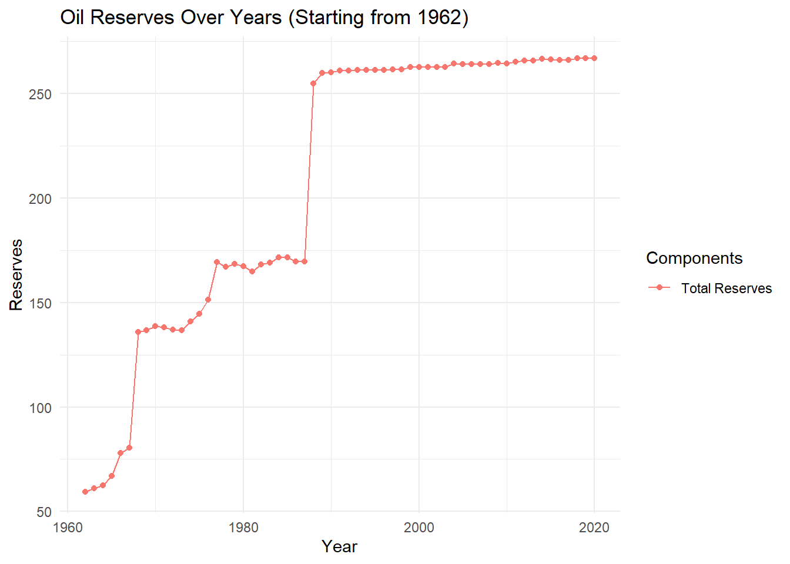
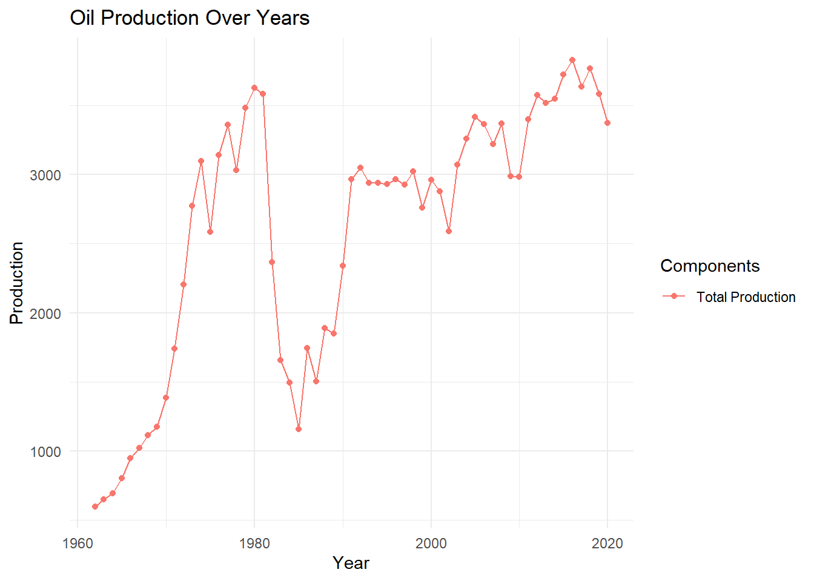
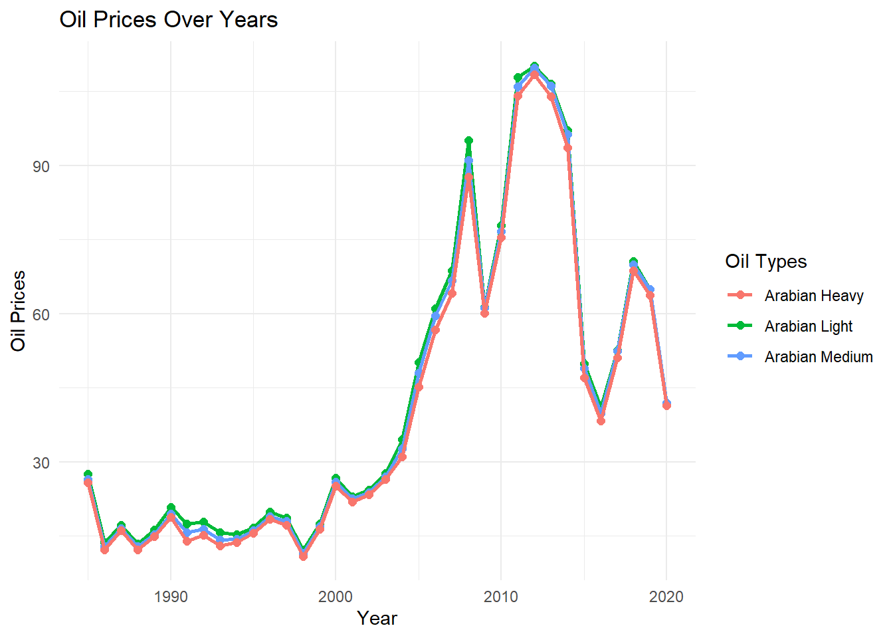

```r
# Load necessary libraries if not already loaded
# install.packages("tidyverse")
library(tidyverse)
```

```
## ── Attaching core tidyverse packages ──────────────────────── tidyverse 2.0.0 ──
## ✔ dplyr     1.1.2     ✔ readr     2.1.4
## ✔ forcats   1.0.0     ✔ stringr   1.5.0
## ✔ ggplot2   3.4.3     ✔ tibble    3.2.1
## ✔ lubridate 1.9.2     ✔ tidyr     1.3.0
## ✔ purrr     1.0.2     
## ── Conflicts ────────────────────────────────────────── tidyverse_conflicts() ──
## ✖ dplyr::filter() masks stats::filter()
## ✖ dplyr::lag()    masks stats::lag()
## ℹ Use the conflicted package (<http://conflicted.r-lib.org/>) to force all conflicts to become errors
```

```r
library(readxl)
```


```r
# Read data from Excel sheets
df_oil_Reserves = read_excel("Annual_Statistics_2020.xlsx", sheet = "10-1")
```

```
## New names:
## • `` -> `...1`
## • `` -> `...3`
## • `` -> `...4`
## • `` -> `...5`
## • `` -> `...7`
## • `` -> `...8`
```

```r
df_oil_production = read_excel("Annual_Statistics_2020.xlsx", sheet = "10-2")
```

```
## New names:
## • `` -> `...1`
## • `` -> `...3`
## • `` -> `...5`
## • `` -> `...6`
## • `` -> `...7`
```

```r
df_oil_prices = read_excel("Annual_Statistics_2020.xlsx", sheet = "10-7")
```

```
## New names:
## • `` -> `...1`
## • `` -> `...3`
## • `` -> `...4`
```

```r
# Data cleaning for df_oil_Reserves
# Remove specific rows
df_oil_Reserves = df_oil_Reserves[-c(1:10, 70:73), ]
# Remove specific columns
df_oil_Reserves = subset(df_oil_Reserves, select = -c(1, 6, 7, 8))
# Rename columns
colnames(df_oil_Reserves) = c("Year", "Saudi Aramco", "Others", "Total")
# Replace "---" values with 5.5, and convert all values to numeric
df_oil_Reserves = df_oil_Reserves %>% mutate_all(~ ifelse(. == "---", 5.5, as.numeric(.)))
```

```
## Warning: There was 1 warning in `mutate()`.
## ℹ In argument: `Others = (structure(function (..., .x = ..1, .y = ..2, . = ..1)
##   ...`.
## Caused by warning in `ifelse()`:
## ! NAs introduced by coercion
```

```r
# Round numeric values to 3 decimal places in columns 2 to 4
df_oil_Reserves[, 2:4] = round(df_oil_Reserves[, 2:4], digits = 3)

#-------------------------------------------------------------------------
# Data cleaning for df_oil_production
# Remove specific rows
df_oil_production = df_oil_production[-c(1:9, 69:71), ]
# Remove specific columns
df_oil_production = subset(df_oil_production, select = -c(1, 6, 7))
# Rename columns
colnames(df_oil_production) = c("Year","Total", "Percentage change", "Daily Average")
# Replace "---" values with 7.2, and convert all values to numeric
df_oil_production = df_oil_production %>% mutate_all(~ ifelse(. == "---", 7.2, as.numeric(.)))
```

```
## Warning: There was 1 warning in `mutate()`.
## ℹ In argument: `Percentage change = (structure(function (..., .x = ..1, .y =
##   ..2, . = ..1) ...`.
## Caused by warning in `ifelse()`:
## ! NAs introduced by coercion
```

```r
# Round numeric values to 3 decimal places in columns 2 to 4
df_oil_production[, 2:4] = round(df_oil_production[, 2:4], digits = 3)

#-------------------------------------------------------------------------
# Data cleaning for df_oil_prices
# Remove specific rows
df_oil_prices = df_oil_prices[-c(1:11,48:50), ]
# Remove specific columns
df_oil_prices = subset(df_oil_prices, select = -c(1))
# Rename columns
colnames(df_oil_prices) = c("Year","Arabian Light", "Arabian Medium", "Arabian Heavy")
# Replace "---" values with 7.2, and convert all values to numeric
df_oil_prices = df_oil_prices %>% mutate_all(~ ifelse(. == "---", 7.2, as.numeric(.)))
# Round numeric values to 3 decimal places in columns 2 to 4
df_oil_prices[, 2:4] = round(df_oil_prices[, 2:4], digits = 3)
```


```r
# View the dataframes
view(df_oil_Reserves)
view(df_oil_production)
view(df_oil_prices)
```


```r
# Oil Reserves plotting
ggplot(df_oil_Reserves, aes(x = Year, y = Total, color = "Total Reserves")) +
  geom_line() +
  geom_point() +
  labs(title = "Oil Reserves Over Years (Starting from 1962)",
       x = "Year",
       y = "Reserves",
       color = "Components") +
  theme_minimal()
```



```r
# Oil Production Plotting 
ggplot(df_oil_production, aes(x = Year, y = Total, color = "Total Production")) +
  geom_line() +
  geom_point() +
  labs(title = "Oil Production Over Years",
       x = "Year",
       y = "Production",
       color = "Components") +
  theme_minimal()
```



```r
# Oil Prices Plotting
ggplot(df_oil_prices, aes(x = Year)) +
  geom_line(aes(y = `Arabian Light`, color = "Arabian Light"), size = 1) +
  geom_point(aes(y = `Arabian Light`, color = "Arabian Light"), size = 2) +
  geom_line(aes(y = `Arabian Medium`, color = "Arabian Medium"), size = 1) +
  geom_point(aes(y = `Arabian Medium`, color = "Arabian Medium"), size = 2) +
  geom_line(aes(y = `Arabian Heavy`, color = "Arabian Heavy"), size = 1) +
  geom_point(aes(y = `Arabian Heavy`, color = "Arabian Heavy"), size = 2) +
  labs(title = "Oil Prices Over Years",
       x = "Year",
       y = "Oil Prices",
       color = "Oil Types") +
  theme_minimal()
```

```
## Warning: Using `size` aesthetic for lines was deprecated in ggplot2 3.4.0.
## ℹ Please use `linewidth` instead.
## This warning is displayed once every 8 hours.
## Call `lifecycle::last_lifecycle_warnings()` to see where this warning was
## generated.
```



```r
# Oil Prices Plotting
ggplot(df_oil_prices, aes(x = Year)) +
  geom_line(aes(y = `Arabian Light`, color = "Arabian Light"), size = 1) +
  geom_point(aes(y = `Arabian Light`, color = "Arabian Light"), size = 2) +
  geom_line(aes(y = `Arabian Medium`, color = "Arabian Medium"), size = 1) +
  geom_point(aes(y = `Arabian Medium`, color = "Arabian Medium"), size = 2) +
  geom_line(aes(y = `Arabian Heavy`, color = "Arabian Heavy"), size = 1) +
  geom_point(aes(y = `Arabian Heavy`, color = "Arabian Heavy"), size = 2) +
  labs(title = "Oil Prices Over Years",
       x = "Year",
       y = "Oil Prices",
       color = "Oil Types") +
  theme_minimal()
```


